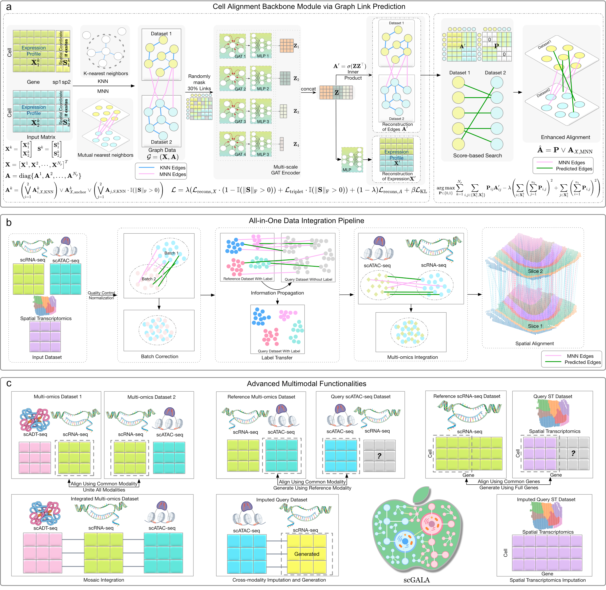

(intro)=
# scGALA
scGala: Graph Link Prediction Based Cell Alignment for Comprehensive Data Integration
## Overview
<!--  -->



## Installation

**Step 1**: Create a [conda](https://docs.anaconda.com/miniconda/install/#quick-command-line-install) environment for scGALA

```bash
conda create -n scGALA python=3.10 -y

conda activate scGALA
``` 
**Step 2**:
Install Pytorch as described in its [official documentation](https://pytorch.org/get-started/locally/). Choose the platform and accelerator (GPU/CPU) accordingly to avoid common dependency issues.

> **A note regarding Additional Libraries for required package PyG**
>
> For required additional libraries in [PyG](https://pytorch-geometric.readthedocs.io/en/latest/install/installation.html), it is hard for PyPI to determine the correct version to install. Please install the additional dependencies accordingly after install scGALA.

```bash
# Pytorch example, choose the cuda version accordingly
pip install torch==2.4.0 torchvision==0.19.0 torchaudio==2.4.0 --index-url https://download.pytorch.org/whl/cu121
# Install scGALA
pip install scGALA
# Example for PyG additional dependencies. Please read the note and install them based on your actual hardware.
# PyG
pip install pyg_lib torch_scatter torch_sparse torch_cluster torch_spline_conv -f https://data.pyg.org/whl/torch-2.4.0+cu121.html
``` 

## Usage:
For the core function, which is the cell alignment in scGALA, simple run:
```python
from scGALA import get_alignments

# You can get the edge probability matrix for one line
alignment_matrix = get_alignments(adata1=adata1,adata2=adata2)

# To get the anchor index for two datasets
anchor_index1, anchor_index2 = alignments_matrix.nonzero()

# The anchor cells are easy to obtain by
anchor_cell1 = adata1[anchor_index1]
anchor_cell2 = adata2[anchor_index1]
```

We also provide convenient APIs for enhancing Seurat-based anchors, imputing spatial transcriptomics, generating cross-modality data, and other useful features. Please refer to Tutorials and APIs for detailed walkthroughs.

## Example Data
All example data used in the Tutorials can be found in [Figshare](https://figshare.com/articles/dataset/Label_Transfer_Example_Data/28728617). The data used in batch correciton tutorial can be found in [Figshare](https://figshare.com/articles/dataset/Benchmarking_atlas-level_data_integration_in_single-cell_genomics_-_integration_task_datasets_Immune_and_pancreas_/12420968).

[github]: https://github.com/mcgilldinglab/scGALA "GitHub source code repository for scGALA"
